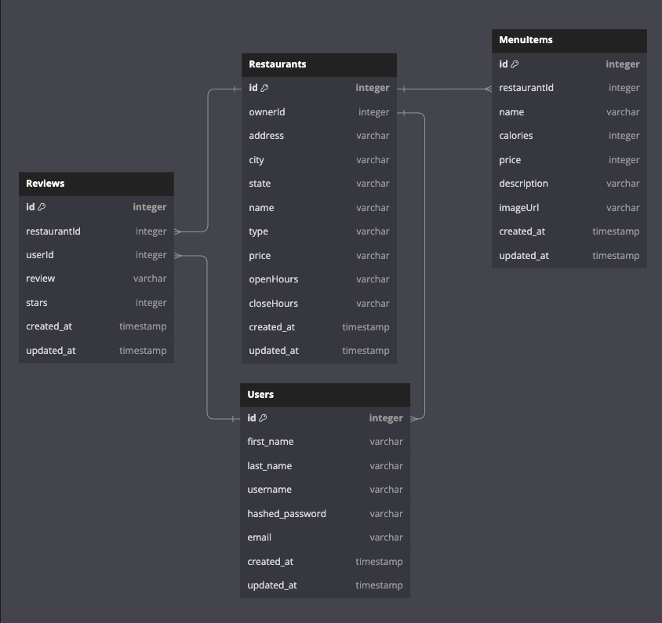

<!--!!START SILENT -->
# YummyEats
<!--!!END -->
<!--!!ADD -->
<!-- # `<name of application here>` -->
<!--!!END_ADD -->

## Database Schema Design

<!--!!START SILENT -->

<!-- ![airbnb-database-schema]
